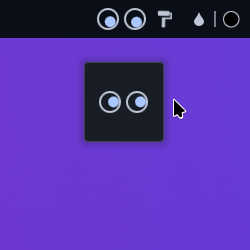

<div align="center">

# Cursor Eyes

Follow mouse widget for the KDE Plasma Desktop inspired by [xfce4-eyes-plugin](https://gitlab.xfce.org/panel-plugins/xfce4-eyes-plugin). A demo of getting KWin Script output from a Plasma Widget using D-Bus and Python



</div>

## TODO

* [ ] Vertical panel
* [ ] Appearance customization maybe?

## Installing

### Requisites

Make sure you have python 3, python-gobject, dbus-python, qt6-tools (for qdbus6) packages installed

Install the widget from the KDE Store ~~[Plasma 6 version](https://store.kde.org/p/2145723)~~ TODO

1. **Right click on the Desktop** > **Edit Mode** > **Add Widgets** > **Get New Widgets** > **Download new...**
2. **Search** for "**Cursor Eyes**", install and add it to your Panel/Desktop.

### Manual install

* Install dependencies (please let me know if I missed something)

  ```txt
    cmake extra-cmake-modules plasma-framework
  ```

* Install the plasmoid

  ```sh
  ./install.sh
  ```

## How does it work?

1. Loads and runs a KWin Script on the fly
2. Creates a D-Bus service
3. The KWin Script sends the cursor position to the D-Bus service
4. The widget gets the last saved cursor position from the D-Bus service

## Credits & Resources

* Inspired by [xfce4-eyes-plugin](https://gitlab.xfce.org/panel-plugins/xfce4-eyes-plugin) [xorg/app/xeyes](https://gitlab.freedesktop.org/xorg/app/xeyes)
* Related topic [Determine when monitor is turned on or off via python dbus](https://discuss.kde.org/t/determine-when-monitor-is-turned-on-or-off-via-python-dbus/11980/7)
* [jinliu/kdotool](https://github.com/jinliu/kdotool) for reading KWin script output inspiration
* [c0d3xd3v/qt-tuxeyes](https://github.com/c0d3xd3v/qt-tuxeyes)
