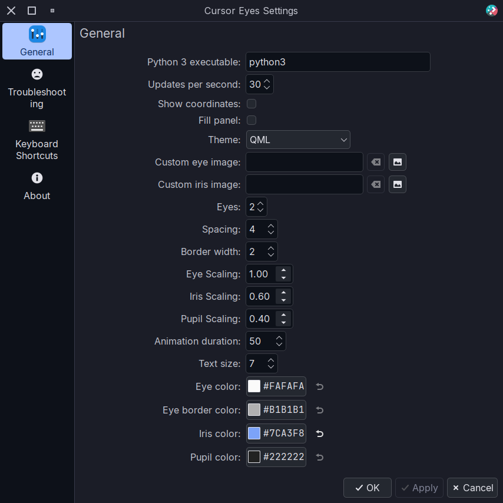

<div align="center">

# Cursor Eyes

Rolling eyes that follow your mouse pointer for the KDE Plasma Desktop inspired by [gnome-applets/geyes](https://gitlab.gnome.org/GNOME/gnome-applets/-/tree/master/gnome-applets/geyes) and derivatives.

<https://github.com/user-attachments/assets/fb58910b-ecb7-4546-8bc7-4c40216ccceb>

</div>

## Features

* Themes
  * QML circles with customizable colors
  * Styles from other popular [Rolling eyes plugins](https://github.com/luisbocanegra/plasma-cursor-eyes/blob/main/package/contents/ui/themes/README.md#authors)
  * Custom images
* Fully customizable, from sizes down to the amount of eyes and spacing between them
* Support for vertical panels

<details>
    <summary>screenshots</summary>




</details>

## Requirements

* Python3
* python-gobject
* dbus-python
* glib2 (`gdbus`)
* kconfig (`kwriteconfig6`) to toggle the KWin Script, or you can do it manually from *System Settings* > *Window Management* > *KWin Scripts* > *Cursor Eyes*
* kpackage (`kpackagetool6`) to install the KWin Script from the widget, or you can install it manually following the steps below

## Installing

> [!IMPORTANT]
> Depending on the hardware you may experience a increase on CPU usage when moving the cursor around while using this widget.
>
> This is due to the current implementation of the widget and the KWin script polling the widget's python D-Bus service. This will be fixed by reimplementing all (or what is possible) as a cpp plugin (no ETA)
>
> It should return to *almost* normal when the cursor is not moving (idle mode). Usage can be decreased by reducing the updates per second from both widget and KWin script settings.

Install the widget from the KDE Store [Plasma 6 version](https://store.kde.org/p/2183752)

1. **Right click on the Desktop** > **Edit Mode** > **Add Widgets** > **Get New Widgets** > **Download new...**
2. **Search** for "**Cursor Eyes**", install and add it to your Panel/Desktop.

    ***Note:** There will be an additional entry called **Cursor Eyes (KWin Script)**, ignore it and proceed to the next step*

3. Click on the widget to complete the setup by installing the KWin Script and starting it.

### Manual install

```sh
git clone https://github.com/luisbocanegra/plasma-cursor-eyes
cd plasma-cursor-eyes
./install.sh
```

**ALTERNATIVE** You can also install through the `./install-with-cmake.sh` script but requires additional dependencies (mostly intended for development/packaging)

* Install dependencies (please let me know if I missed something)

  ```txt
    cmake extra-cmake-modules plasma-framework
  ```

* Install the plasmoid

  ```sh
  ./install-with-cmake.sh
  ```

## Submitting new themes

Instructions to add new themes are [here](https://github.com/luisbocanegra/plasma-cursor-eyes/blob/main/package/contents/ui/themes/README.md)

## How does it work?

1. A KWin Script that reads the cursor position x times per second (default is 30)
2. Widget starts a D-Bus service (python script) to store and return the cursor position
3. KWin Script sends the cursor position to the D-Bus service
4. Widget gets the last saved cursor position from the running D-Bus service
5. When there are multiple instances of the widget only one runs the service

## Similar projects

* [gnome-applets/geyes](https://gitlab.gnome.org/GNOME/gnome-applets/-/tree/master/gnome-applets/geyes)
* [xfce4-eyes-plugin](https://gitlab.xfce.org/panel-plugins/xfce4-eyes-plugin)
* [lxqt-panel/plugin-qeyes](https://github.com/lxqt/lxqt-panel/tree/master/plugin-qeyes/)
* [c0d3xd3v/qt-tuxeyes](https://github.com/c0d3xd3v/qt-tuxeyes)

## Acknowledgements

* Themes (images) sources are listed [here](https://github.com/luisbocanegra/plasma-cursor-eyes/blob/main/package/contents/ui/themes/README.md)
* [jinliu/kdotool](https://github.com/jinliu/kdotool) for reading KWin script output inspiration
* Related topic [Determine when monitor is turned on or off via python dbus](https://discuss.kde.org/t/determine-when-monitor-is-turned-on-or-off-via-python-dbus/11980/7)
